<div align="center">



<br><br>

[](https://world-cup2026-sigma-weld.vercel.app/)
[](https://react.dev/)
[](https://developer.mozilla.org/es/docs/Web/JavaScript)
[](https://vitest.dev/)
[](https://tailwindcss.com/)
[](https://ai.google.dev/)
[](https://nodejs.org/)
[](https://vitejs.dev/)
[](https://figma.com/)

<p align="center">
  <b>¡Hola! Te doy la bienvenida a mi portafolio profesional interactivo y asistente IA conversacional</b><br>
  He diseñado y desarrollado esta plataforma con una experiencia inmersiva Matrix Cyberpunk, código limpio y rendimiento optimizado.
</p>

[🌐 Ver Mi Portafolio en Vivo (Vercel)](https://world-cup2026-sigma-weld.vercel.app/) • [💼 Conectar en LinkedIn](https://linkedin.com/in/patriciaapariciodiaz) • [🐙 Ver Mis Repositorios en GitHub](https://github.com/apariciodiazpatricia-cell) • [📧 Escribirme un Correo](mailto:apariciodiazpatricia@gmail.com)

</div>

---

## 👩‍💻 01. QUIÉN SOY & MI HISTORIA

```yaml
> MI NOMBRE COMPLETO : Patricia Aparicio Díaz (llámame Patri)
> MI ROL ACTUAL      : Desarrolladora Frontend Junior
> MIS ESPECIALIDADES : React (18/19), JavaScript (ES6+), Tailwind CSS, Figma & Stitch
> MI FORMACIÓN       : Inmersa al 100% en un Bootcamp Intensivo de Desarrollo Web (+600 Horas)
> MI SIGUIENTE PASO  : Titularme como Desarrolladora Full Stack (Node.js, PostgreSQL, IA)
> MI UBICACIÓN       : Sevilla, España (Disponible para trabajar en remoto o híbrido)
> MI DISPONIBILIDAD  : Inmediata para incorporarme a tu equipo de desarrollo Frontend
> MI ESTADO ACTUAL   : Con muchas ganas de sumar, aprender y programar grandes proyectos 🚀
```

¡Hola! Soy **Patri Aparicio**. Te doy la bienvenida a mi espacio personal y profesional.

Desde que me adentré en el mundo del desarrollo web supe que el **Frontend** era mi pasión. Disfruto muchísimo estructurando aplicaciones reactivas y modulares en **React**, escribiendo código limpio en **JavaScript moderno**, cuidando cada píxel con **Tailwind CSS**, diseñando experiencias de usuario en **Figma & Stitch** y consumiendo APIs REST para dar vida a interfaces útiles e intuitivas.

Aporto a los equipos técnicos una valiosa trayectoria previa en resolución ágil de problemas, gestión y atención cercana, lo que me permite adaptarme con rapidez, comunicarme con claridad y trabajar con total compromiso.

Actualmente estoy dedicada de lleno a un **Bootcamp intensivo de más de 600 horas de programación web**, consolidando mis bases frontend y expandiéndome hacia el backend (Node.js, Express, PostgreSQL) y la Inteligencia Artificial, con la meta de convertirme en **Desarrolladora Full Stack en breve**.

---

## 🌌 02. LA EXPERIENCIA VISUAL CYBERPUNK QUE HE CREADO

Para este portafolio quise alejarme de los diseños planos y convencionales. Diseñé una interfaz **Cyberpunk Matrix** con tonos oscuros profundos (`#000000`, `#0d0d0d`, `#141414`) y luces de neón verde (`#00FF66`), amarillo cibernético (`#FFE600`) y cian (`#00FFAA`), con elementos visuales únicos:

* 🟢 **Lluvia Digital Matrix (`MatrixRain.jsx`):** Creé un motor en Canvas que dibuja cascadas continuas de código binario, glifos y fragmentos de JavaScript sin penalizar los fotogramas de la web.
* 🕹️ **Navbar Pac-Man Fijo (`NavbarPacman.jsx`):** Diseñé una barra superior fija (`fixed top-0 z-50`) con una pista donde Pac-Man recorre la pantalla persiguiendo y comiéndose a los **fantasmitas** vulnerables (generando puntuaciones emergentes de +200, +400, +800 y +1600 pts) en un flujo dinámico continuo.
* 🤖 **Drones Exploradores Autónomos (`HeroRobot.jsx` & `Footer.jsx`):** Integré droides de patrulla (`[-O_O-] SCOUT_BOT`) que se desplazan de lado a lado por encima de mi sección **Sobre Mí** y en el **Footer**, monitorizando el estado del sistema.
* 📺 **Avatar Holográfico con Scanlines CRT:** Mi fotografía de perfil incluye un efecto de monitor de tubo futurista con líneas de escaneo interlineadas, haz de láser táctico en barrido vertical y marcadores HUD.
* 📄 **Visor Interactivo de mi CV (`CvSection.jsx`):** Desarrollé un módulo que muestra mi Curriculum Vitae con una capa traslúcida que lo oscurece suavemente, con controles para verlo en pantalla completa o descargarlo en PDF.

---

## 🧠 03. PATRI AI: MI ASISTENTE CONVERSACIONAL CON GOOGLE GEMINI

```
┌────────────────────────────────────────────────────────────────────────┐
│                   ARQUITECTURA DE MI ASISTENTE IA                      │
├────────────────────────────────────────────────────────────────────────┤
│  [ Visitante / Reclutador ] ──> [ PortfolioAssistant.jsx ]             │
│                                           │                            │
│                         ├──> ¿Servidor Activo? ──(SÍ)──> [ Express ]   │
│                         │                                    │         │
│                         │                             [ Gemini 2.5 ]   │
│                         │                                    │         │
│                         └──> ¿Sin Backend?     ──(NO)──> [ Smart Local │
│                                                            Fallback ]  │
└────────────────────────────────────────────────────────────────────────┘
```

### ¿Por qué y para qué lo he creado?
Creé a **Patri AI** para que cualquier reclutador o líder técnico pueda hacerme preguntas sobre mi perfil de forma interactiva y natural en lugar de limitarse a leer un texto plano. 

### ¿Cómo funciona en detalle?
1. **Google Gemini 2.5 Flash API (`@google/genai`):**
   - He configurado un endpoint seguro en Node.js/Express (`server/services/geminiService.js`) con un **System Prompt personalizado**.
   - Le enseño al modelo exactamente quién soy, mis proyectos, mis tecnologías dominadas y mi disponibilidad inmediata como Frontend Junior.
2. **Sincronización Automática con mi CV (`CvContext.jsx`):**
   - El asistente lee e ingesta en memoria el contenido de mi Curriculum Vitae oficial para responder con absoluta precisión a preguntas sobre mis estudios, tecnologías y habilidades.
3. **Smart Fallback Local Engine (Sin caídas de servicio):**
   - Si visitas el portafolio sin arrancar el backend en local o hay algún microcorte en la API, mi motor local en JavaScript (`src/services/api.js`) asume el control respondiendo de forma inteligente para que **nunca te quedes sin respuesta**.
4. **Preguntas Sugeridas Rápidas:**
   - Botones rápidos integrados: *"¿Quién es Patri?"*, *"Stack tecnológico"*, *"Figma y Stitch"*, *"¿Disponible para trabajar?"*, etc.

---

## 🌐 04. APIS Y SERVICIOS EXTERNOS INTEGRADOS

Mi portafolio se conecta activamente con diversos servicios externos:

| Servicio / API | Librería / Protocolo | ¿Para qué lo utilizo en el proyecto? |
| :--- | :--- | :--- |
| 🤖 **Google Gemini 2.5 Flash** | `@google/genai` | Asistente de inteligencia artificial que responde a tus preguntas sobre mi perfil profesional. |
| ⛅ **OpenWeather API** | REST / Fetch JSON | Obtención en directo del clima y temperatura meteorológica de Sevilla en la cabecera. |
| 💬 **Developer Quotes API** | Polling / Local Stream | Flujo dinámico de citas célebres de la ingeniería de software en mi widget de terminal. |
| 📄 **PDF Parse & Ingestion Engine** | `pdf-parse` / `FileReader` | Lectura sincronizada de mi currículum en PDF para alimentar la memoria contextual del chatbot. |
| 🛠️ **API Propia CRUD (Buhardilla Retro)** | REST Custom Endpoint | Operaciones CRUD completas (crear, leer, actualizar y eliminar artículos) y gestión de usuarios. |

---

## 🚀 05. MIS PROYECTOS DESTACADOS

Todos mis proyectos cuentan con repositorio público en GitHub, despliegue en directo en Vercel y grabaciones en vídeo demostrativas integradas en el portafolio:

### 1. 🏆 **WORLD CUP 2026**
* **Descripción:** Aplicación deportiva completa en tiempo real para el Mundial 2026.
* **Stack:** React 19, JavaScript ES6+, React Router, CSS Variables, REST APIs.
* **Aspectos Destacados:** Estadísticas dinámicas, filtros en tiempo real, navegación fluida y arquitectura modular.
* **Demo en Vivo:** [world-cup2026-sigma-weld.vercel.app](https://world-cup2026-sigma-weld.vercel.app/)

### 2. 🏡 **HABITATCODE INMOBILIARIA**
* **Descripción:** Plataforma inmobiliaria de diseño premium para búsqueda y gestión de propiedades.
* **Stack:** React, Tailwind CSS, Componentes Modulares, Filtros Dinámicos de Búsqueda.
* **Aspectos Destacados:** Prototipado previo en **Figma** trasladado fielmente a código React (*Pixel-Perfect*).

### 3. 🛡️ **VALHALLA DEL CHATARRERO**
* **Descripción:** E-commerce inmersivo con temática post-apocalíptica y cyber-punk.
* **Stack:** React, OpenWeather API, Audio/Video FX, Gestión Reactiva de Estado.
* **Aspectos Destacados:** Adaptación ambiental visual en directo según el clima meteorológico de la zona.
* **Demo en Vivo:** [valhalla-del-chatarrero.vercel.app](https://valhalla-del-chatarrero.vercel.app/)

### 4. 📻 **LA BUHARDILLA RETRO**
* **Descripción:** E-commerce vintage de artículos retro (años 60, 70 y 80).
* **Stack:** React, API Propia CRUD, Gestión de Usuarios, OpenWeather API, Tailwind CSS.
* **Aspectos Destacados:** Consume una API propia para operaciones CRUD de catálogo y usuarios, sincronizada con efectos climáticos.
* **Demo en Vivo:** [la-buhardilla-retro.vercel.app](https://la-buhardilla-retro.vercel.app/)

---

## 🛠️ 06. MI STACK TECNOLÓGICO COMPLETO

```text
┌───────────────────────────┬───────────────────────────┐
│ 🎨 FRONTEND & UI          │ 📐 DISEÑO & PROTOTIPADO   │
├───────────────────────────┼───────────────────────────┤
│ • React 19 / 18           │ • Figma (UI/UX & Tokens)  │
│ • JavaScript ES6+ Moderno │ • Stitch (Generative UI)  │
│ • Tailwind CSS            │ • Wireframing & UX Flows  │
│ • React Router            │ • Responsive Layouts      │
│ • HTML5 Semántico & CSS3  │ • Git & GitHub Workflow   │
├───────────────────────────┼───────────────────────────┤
│ ⚙️ BACKEND & APIS (Próx)   │ 🧪 TESTING & QA           │
├───────────────────────────┼───────────────────────────┤
│ • Node.js & Express       │ • Vitest                  │
│ • PostgreSQL & SQL        │ • React Testing Library   │
│ • Google Gemini 2.5 Flash │ • Component & Unit Tests  │
│ • RESTful APIs & CRUD     │ • Clean Code & QA         │
└───────────────────────────┴───────────────────────────┘
```

---

## 🧪 07. TESTING AUTOMATIZADO

He integrado una suite completa de pruebas unitarias y de componentes con **Vitest** y **React Testing Library**:

```bash
# Ejecutar todas las pruebas automatizadas
npm run test
```

* ✅ `src/tests/portfolioData.test.js`: Verificación de integridad de datos del perfil y proyectos.
* ✅ `src/tests/api.test.js`: Validación del motor Smart Fallback y respuestas del asistente IA.
* ✅ `src/tests/components.test.jsx`: Pruebas de renderizado de componentes clave (`HeroRobot`, `ApiWidget`).
* 📊 **Resultado:** 10/10 tests pasados (100% de éxito).

---

## 💻 08. CÓMO CLONAR Y EJECUTAR ESTE PROYECTO EN LOCAL

Sigue estos sencillos pasos para poner en marcha mi portafolio en tu máquina:

### Prerrequisitos
- Tener instalado **Node.js** (versión 18 o superior).
- Tener instalado **Git**.

### Paso 1: Clonar el repositorio
```bash
git clone https://github.com/apariciodiazpatricia-cell/patricia-aparicio-dev.git
cd patricia-aparicio-dev
```

### Paso 2: Instalar las dependencias del frontend
```bash
npm install
```

### Paso 3 (Opcional): Instalar y configurar el backend de IA
```bash
cd server
npm install

# Crea un archivo .env en la carpeta server con tu clave de Google Gemini
# GEMINI_API_KEY=tu_api_key_aqui

# Iniciar el servidor backend
node index.js
```
*(Nota: Si no inicias el backend, el frontend funcionará perfectamente gracias a mi motor de Fallback inteligente).*

### Paso 4: Iniciar el servidor de desarrollo
En la raíz del proyecto:
```bash
npm run dev
```
Abre tu navegador en `http://localhost:5173` para disfrutar de la experiencia.

### Paso 5: Compilar para producción (Build)
```bash
npm run build
```

---

## 📚 09. DOCUMENTACIÓN TÉCNICA DEL PROYECTO

Para profundizar en la arquitectura y decisiones técnicas, consulta las guías que he preparado en la carpeta [`docs/`](./docs/):

* 🏛️ [**Guía de Arquitectura del Sistema**](./docs/ARCHITECTURE.md)
* 🧩 [**Catálogo Detallado de Componentes**](./docs/COMPONENTS.md)
* 📡 [**Referencia de Endpoints y APIs**](./docs/API_REFERENCE.md)
* 🧪 [**Guía de Testing con Vitest y RTL**](./docs/TESTING.md)
* 🚀 [**Manual de Despliegue en Vercel y Cloud**](./docs/DEPLOYMENT_GUIDE.md)

---

## 🕹️ 10. PAC-MAN RUNWAY: FINAL DINÁMICO & INTERACTIVO

<div align="center">



</div>

---

### 📬 ¿Hablamos? ¡Estaré encantada de charlar contigo!

<table align="center" style="border: 2px solid #00FF66; border-radius: 16px; background-color: #0d0d0d;">
  <tr>
    <td align="center" style="padding: 24px;">
      <br><br>
      <h3 style="color: #ffffff; margin: 0;"><b>PATRICIA APARICIO DÍAZ</b></h3>
      <p style="color: #00FF66; font-family: monospace; font-size: 14px; margin: 4px 0 16px 0;"><b>⚡ FRONTEND DEVELOPER JUNIOR ⚡</b></p>
      <p style="color: #a0a0a0; font-size: 13px; max-width: 450px;">
        Apasionada por crear interfaces increíbles en React, código limpio y experiencias interactivas memorables. ¡Disponible para incorporarme de forma inmediata!
      </p>
      <br>
      <a href="https://linkedin.com/in/patriciaapariciodiaz">
        
      </a>
      &nbsp;
      <a href="https://github.com/apariciodiazpatricia-cell">
        
      </a>
      &nbsp;
      <a href="mailto:apariciodiazpatricia@gmail.com">
        
      </a>
      &nbsp;
      <a href="https://world-cup2026-sigma-weld.vercel.app/">
        
      </a>
      <br><br>
      <p style="color: #777; font-size: 11px; font-family: monospace;">
        📍 Sevilla, España • 🌍 Remoto / Híbrido • 📞 627 50 52 39
      </p>
    </td>
  </tr>
</table>

<br>

<p align="center" style="font-family: monospace; font-size: 12px; color: #555;">
  Diseñado con 💚 y código limpio por <b>Patri Aparicio</b> © 2026. Todos los derechos reservados.
</p>

</div>
